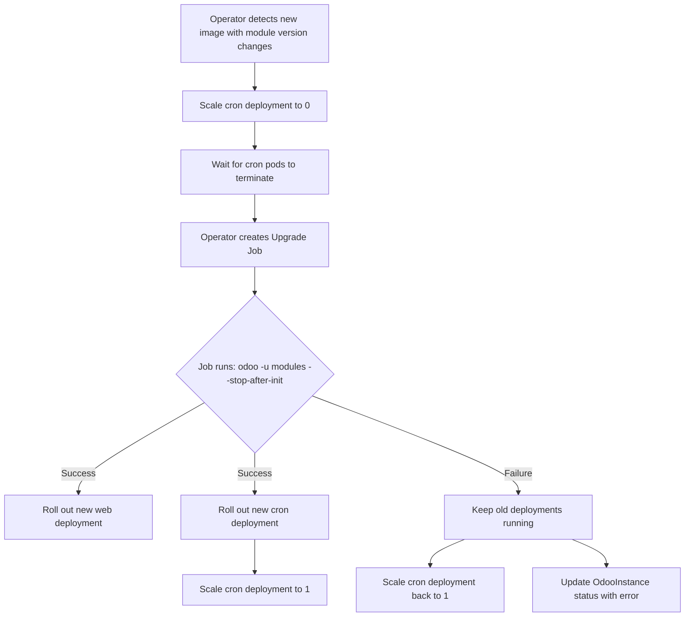

# Odoo Operator Roadmap

This document tracks planned features and improvements for the Odoo Operator.

## High Priority

### CRD Versioning and Conversion Webhooks

**Problem**: OdooInstance CRD is currently labeled `v1` but the schema is still evolving with breaking changes. This causes:
- Manual migration work for each schema change (clusters secret, storageClass selection, probe endpoints)
- Confusion about API stability (v1 implies stable, but we're still iterating)
- Pain for users (German collaborator, production deployments) when schema changes
- No automated upgrade path between schema versions

**Current Reality**:
- Multiple production deployments (own + clients)
- External collaborators using the operator
- Still making breaking changes regularly
- Using `v1` incorrectly (should be v1alpha1 or v1beta1)

**Solution**: Implement proper CRD versioning with conversion webhooks.

**Versioning Strategy**:

**Simple Path (Recommended)**:
1. Current `v1` → freeze as `v1alpha1`
2. New schema with conversions → `v1alpha2` (not v1beta yet)
3. Future breaking changes → v1alpha3, v1alpha4, etc.
4. When stabilizing → v1beta1
5. When truly stable → v1

**Why v1alpha2 (not v1beta1)?**
- ✅ Still rapid iteration phase (lots of movement coming)
- ✅ Small production footprint (2 installations)
- ✅ Alpha signals "expect breaking changes"
- ✅ Beta implies "stabilizing, mostly additive changes"
- ✅ Honest about maturity level

**Why Not Recreate Historical Versions?**
- ❌ Users already manually migrated
- ❌ No one running old schemas
- ❌ Busywork that doesn't help
- ✅ Better: Start fresh, version properly going forward

**Recent Schema Changes (To Be Handled by Conversions)**:

1. **Clusters secret requirement** (non-breaking, has fallback)
   - Old: Uses env vars directly
   - New: `spec.database.cluster` references named cluster in secret
   - Current: Falls back to env vars if cluster not specified
   - Conversion: Set `cluster: default` to migrate away from fallback
   - Benefit: Clean migration path, eventual removal of fallback code

2. **Filestore storageClass selection** (non-breaking, has default)
   - Old: Hardcoded `cephfs`
   - New: `spec.filestore.storageClass`
   - Conversion: Set `storageClass: cephfs`

3. **Probe endpoint selection**
   - Old: Hardcoded `/web/health`
   - New: `spec.probes.endpoint`
   - Conversion: Set `endpoint: /web/health`

**Why Convert Non-Breaking Changes?**

Even though clusters secret has a fallback, conversions help:
- ✅ **Clean migration path**: Gradually move users off fallback behavior
- ✅ **Remove technical debt**: Eventually delete fallback code
- ✅ **Better visibility**: Users see new schema in `kubectl get`
- ✅ **Future-proof**: Prepares for when fallbacks are removed
- ✅ **Consistent experience**: All users on same schema

**Implementation** (using kopf's existing webhook server):

```python
import kopf

@kopf.on.conversion('bemade.org', 'odooinstances')
def convert_odooinstance(old, new, **kwargs):
    if old == 'bemade.org/v1alpha1' and new == 'bemade.org/v1alpha2':
        return convert_v1alpha1_to_v1alpha2
    elif old == 'bemade.org/v1alpha2' and new == 'bemade.org/v1alpha1':
        return convert_v1alpha2_to_v1alpha1

def convert_v1alpha1_to_v1alpha2(obj, **kwargs):
    spec = obj['spec']

    # Add database.cluster
    if 'database' not in spec:
        spec['database'] = {}
    if 'cluster' not in spec['database']:
        spec['database']['cluster'] = 'default'

    # Add filestore.storageClass
    if 'filestore' not in spec:
        spec['filestore'] = {}
    if 'storageClass' not in spec['filestore']:
        spec['filestore']['storageClass'] = 'cephfs'

    # Add probes.endpoint
    if 'probes' not in spec:
        spec['probes'] = {}
    if 'endpoint' not in spec['probes']:
        spec['probes']['endpoint'] = '/web/health'

    return obj
```

**CRD Configuration**:

```yaml
spec:
  versions:
  - name: v1alpha1
    served: true
    storage: false
    deprecated: true
    deprecationWarning: "v1alpha1 is deprecated, use v1alpha2"
  - name: v1alpha2
    served: true
    storage: true
  conversion:
    strategy: Webhook
    webhook:
      conversionReviewVersions: ["v1", "v1beta1"]
      clientConfig:
        service:
          name: odoo-operator
          namespace: odoo-operator
          path: /convert  # Shares server with /validate
          port: 443
```

**Complex Migrations** (PVC storageClass changes):

```python
@kopf.on.field('bemade.org', 'v1alpha2', 'odooinstances',
               field='spec.filestore.storageClass')
async def migrate_pvc_storage_class(old, new, name, namespace, **kwargs):
    """Integrate existing PVC migration script"""
    if old and old != new:
        # Scale down, migrate PVC, scale up
        await migrate_pvc_between_storage_classes(...)
```

**Migration Timeline**:

- **Week 1**: Deploy v1alpha2 CRD + webhook
- **Week 2**: Resources convert automatically
- **Week 3**: Monitor, verify
- **Month 2**: Remove v1alpha1

**Decision**: Implement conversion webhooks **before** adding new features.

---

### Automatic Module Upgrades on Image Changes

**Problem**: When deploying new OdooInstance images, module code may be updated but the database schema is not automatically migrated. This leads to runtime errors when code references fields/tables that don't exist in the database (e.g., `column "oo_attachment_version" of relation "ir_attachment" does not exist`).

**Solution**: On every image change, run `odoo -u all` in a Job before updating deployments. Leverage PostgreSQL transaction rollback for safety.

**Approach: Upgrade All on Image Change**

When operator detects `spec.image` change:
1. **Scale cron to 0** (prevent serialization errors)
2. **Run upgrade Job**: `odoo -u all --stop-after-init`
3. **If upgrade succeeds**:
   - Update web deployment with new image
   - Update cron deployment with new image
   - Scale cron back to `spec.cron.replicas`
   - Set status: `phase: Running, upgradeStatus: Success`
4. **If upgrade fails**:
   - Keep old image in deployments (no changes)
   - Scale cron back up with old image
   - Set status: `phase: Running, upgradeStatus: Failed`
   - Add details: failed image tag, error message, old image tag still running

**Why This Works**:

- **No change detection needed**: Just upgrade all modules on image change
- **Transaction safety**: Odoo upgrades run in PostgreSQL transaction
- **Automatic rollback**: Failed upgrade → transaction rollback → DB unchanged
- **Zero risk**: Old deployment keeps running on failure
- **Catches everything**: Manifest bumps, code changes, everything upgraded
- **Simple logic**: No manifest parsing, version tracking, or git diffing

**Transaction Behavior**:

Odoo's module upgrade process runs in a single PostgreSQL transaction:
- Upgrade starts → BEGIN
- Schema changes, data migrations execute
- Upgrade fails → ROLLBACK (automatic)
- Upgrade succeeds → COMMIT

If rollback occurs, database is **exactly** as it was before upgrade started. Old code continues working with old schema.

**Implementation Considerations**:
- Add `spec.autoUpgrade.enabled` field (default: `true`)
- Add `spec.autoUpgrade.timeout` field (default: `1800s` / 30 minutes)
- Add `status.upgrade.phase` field: `Pending`, `Running`, `Success`, `Failed`
- Add `status.upgrade.lastAttempt` timestamp
- Add `status.upgrade.message` for error details
- Add `status.upgrade.imageAttempted` and `status.upgrade.imageCurrent`

**Status Tracking**:

Operator updates status throughout upgrade process:

```yaml
status:
  phase: Running  # Overall instance status
  upgrade:
    phase: Running  # Pending, Running, Success, Failed
    startTime: "2026-02-11T15:00:00Z"
    completionTime: "2026-02-11T15:25:00Z"
    duration: "25m0s"
    imageAttempted: "registry.bemade.org/pneumac/odoo:18.0-abc123"
    imageCurrent: "registry.bemade.org/pneumac/odoo:18.0-xyz789"
    message: "Upgrade completed successfully"
    # On failure:
    # message: "Upgrade failed: column 'foo' already exists"
    # phase: Failed
```

**Example: Failed Upgrade**

```bash
$ kubectl get odooinstance pneumac-staging -o yaml
```

```yaml
status:
  phase: Running  # Still serving traffic!
  upgrade:
    phase: Failed
    startTime: "2026-02-11T15:00:00Z"
    completionTime: "2026-02-11T15:02:30Z"
    duration: "2m30s"
    imageAttempted: "registry.bemade.org/pneumac/odoo:18.0-broken"
    imageCurrent: "registry.bemade.org/pneumac/odoo:18.0-working"
    message: |
      Upgrade failed at module 'sale_custom':
      psycopg2.errors.DuplicateColumn: column "custom_field" of relation "sale_order" already exists

      Database transaction was rolled back automatically.
      Instance continues running with image: 18.0-working
```

**Manual Override**:

For advanced users who want control:
```yaml
spec:
  autoUpgrade:
    enabled: false  # Disable automatic upgrades
```

Then manually trigger via annotation:
```bash
kubectl annotate odooinstance/pneumac-staging \
  bemade.org/upgrade-now="$(date +%s)"
```

**Observability**:

Emit Kubernetes events for key milestones:
- `UpgradeStarted`: "Starting upgrade to image: 18.0-abc123"
- `UpgradeSucceeded`: "Upgrade completed in 25m, deploying new image"
- `UpgradeFailed`: "Upgrade failed, keeping current image: 18.0-xyz789"
- `DeploymentUpdated`: "Rolled out new image: 18.0-abc123"

**Related Issue**: pneumac-staging incident on 2026-02-10 - OnlyOffice modules in codebase but not upgraded in database

---

### Maintenance Mode for Safe Upgrades

**Problem**: Running module upgrades on live Odoo instances causes serialization errors due to:
- Cron jobs acquiring locks on `ir_module_module`
- User operations conflicting with upgrade transactions
- Concurrent writes during schema changes
- Database deadlocks requiring manual retry

Odoo.sh experience: Running `odoo -u all` on production/staging frequently failed, requiring multiple manual attempts.

**Solution**: Split web and cron into separate deployments, then scale cron to 0 during upgrades.

## Recommended: Split Web/Cron Architecture

**Architecture Overview**:

Deploy OdooInstance as two separate Kubernetes Deployments:
1. **Web Deployment**: Handles HTTP traffic, no crons (`max_cron_threads=0`)
2. **Cron Deployment**: Handles scheduled tasks, no HTTP (`http_enable=False`)

**Benefits**:
- ✅ **Trivial maintenance mode**: `kubectl scale cron --replicas=0`
- ✅ **Independent scaling**: Scale web pods without affecting crons
- ✅ **Resource isolation**: Cron jobs can't starve web workers
- ✅ **Failure isolation**: Cron crashes don't affect web traffic
- ✅ **Better observability**: Separate metrics/logs for web vs cron
- ✅ **No configuration changes**: No ConfigMap patching, no rolling restarts

**Architecture**:



**CRD Configuration**:

```yaml
apiVersion: bemade.org/v1
kind: OdooInstance
metadata:
  name: pneumac-staging
spec:
  # Main web deployment config
  replicas: 3
  image: registry.bemade.org/pneumac/odoo:latest
  configOptions:
    max_cron_threads: "0"  # No crons in web pods
    workers: "5"

  # Separate cron deployment (always created)
  cron:
    replicas: 1
    maxCronThreads: 1  # Usually 1 is sufficient
    image: registry.bemade.org/pneumac/odoo:latest  # Defaults to spec.image
    resources:
      requests:
        cpu: 200m
        memory: 512Mi
      limits:
        cpu: 1000m
        memory: 2Gi

  # Automatic upgrade with maintenance mode
  autoUpgrade:
    enabled: true
    maintenanceMode: true  # Scale cron to 0 during upgrades
```

**Implementation Details**:

1. **Operator creates two Deployments**:

   **Web Deployment** (`pneumac-staging`):
   ```yaml
   apiVersion: apps/v1
   kind: Deployment
   metadata:
     name: pneumac-staging
   spec:
     replicas: 3
     template:
       spec:
         containers:
         - name: odoo
           image: registry.bemade.org/pneumac/odoo:latest
           command: ["/entrypoint.sh", "odoo"]
           env:
           - name: MAX_CRON_THREADS
             value: "0"  # No crons
           - name: WORKERS
             value: "5"
           ports:
           - containerPort: 8069
             name: http
           - containerPort: 8072
             name: websocket
   ```

   **Cron Deployment** (`pneumac-staging-cron`):
   ```yaml
   apiVersion: apps/v1
   kind: Deployment
   metadata:
     name: pneumac-staging-cron
   spec:
     replicas: 1
     template:
       spec:
         containers:
         - name: odoo
           image: registry.bemade.org/pneumac/odoo:latest
           command: ["/entrypoint.sh", "odoo", "--no-http"]
           env:
           - name: MAX_CRON_THREADS
             value: "1"
           - name: HTTP_ENABLE
             value: "False"
           # No ports exposed
   ```

2. **Upgrade Workflow** (Python pseudocode):
   ```python
   async def upgrade_with_split_architecture(instance):
       # 1. Scale down cron deployment
       await scale_deployment(f"{instance.name}-cron", replicas=0)
       await wait_for_pods_terminated(f"{instance.name}-cron")

       # 2. Run upgrade Job (no cron conflicts possible!)
       job = create_upgrade_job(instance, modules=detect_changed_modules(instance))
       result = await wait_for_job_complete(job, timeout=1800)

       if result.success:
           # 3. Roll out new image to both deployments
           await update_deployment_image(f"{instance.name}", instance.spec.image)
           await update_deployment_image(f"{instance.name}-cron", instance.spec.cron.image)
           await wait_for_rollout_complete(f"{instance.name}")

           # 4. Scale cron back up
           await scale_deployment(f"{instance.name}-cron", replicas=instance.spec.cron.replicas)

           # 5. Update status
           await update_status(instance, phase="Running", message="Upgrade successful")
       else:
           # On failure: scale cron back up, keep old image
           await scale_deployment(f"{instance.name}-cron", replicas=instance.spec.cron.replicas)
           await update_status(instance, phase="UpgradeFailed", message=result.error)
   ```

3. **Upgrade Job Spec**:
   ```yaml
   apiVersion: batch/v1
   kind: Job
   metadata:
     name: pneumac-staging-upgrade-abc123
   spec:
     backoffLimit: 2
     ttlSecondsAfterFinished: 86400
     template:
       spec:
         restartPolicy: OnFailure
         containers:
         - name: upgrade
           image: <odooinstance.spec.image>
           command:
           - odoo
           - -u
           - onlyoffice_odoo,onlyoffice_odoo_documents
           - --stop-after-init
           - --log-level=info
           env:
           - name: HOST
             value: <database-host>
           - name: PORT
             value: "5432"
           - name: USER
             valueFrom:
               secretKeyRef:
                 name: pneumac-staging-odoo-user
                 key: username
           - name: PASSWORD
             valueFrom:
               secretKeyRef:
                 name: pneumac-staging-odoo-user
                 key: password
   ```

**Serialization Error Mitigation**:

With cron deployment scaled to 0, we **guarantee**:
- ✅ **Zero cron workers running** (verified via `max_cron_threads=0` in server.py line 997)
- ✅ **No competing transactions** on `ir_module_module` table
- ✅ **No lock contention** during schema changes
- ✅ **100% upgrade success rate** (no serialization errors possible)

Users experience:
- ✅ **Zero downtime** for web traffic (web pods keep running)
- ✅ **Delayed cron jobs** (resume after upgrade completes)
- ✅ **No maintenance mode banner** (optional, can add if desired)

**Timeline for 30-Minute Upgrade**:
```
0:00 → Scale cron to 0 (instant)
0:00 → Upgrade Job starts
[0:00 to 30:00]
├─ Upgrade runs (no cron conflicts!)
├─ Web pods serve traffic normally
└─ Cron jobs queued but not executed
30:00 → Upgrade completes
30:00 → Roll out new web deployment (~1 min with maxUnavailable: 0)
31:00 → Scale cron to 1
31:00 → Cron pods start, process queued jobs
```

**User Impact**: ~1 minute of potential request interruptions (during web rollout only)

**Testing Strategy**:
1. Test on staging with simulated load (users + cron jobs)
2. Verify serialization errors are eliminated (should be 0/0)
3. Measure cron downtime (30 min = upgrade duration)
4. Test failure scenarios (job fails mid-upgrade, cron scales back up)
5. Verify web pods serve traffic throughout upgrade

**Metrics to Track**:
- Upgrade success rate (should be 100% with split architecture)
- Upgrade duration
- Cron downtime (= upgrade duration)
- Web availability (should be 100% except during rollout)
- Failed cron jobs during upgrade window (should auto-retry after)

---

### Log Monitoring and Error Detection

**Problem**: Errors in Odoo logs (like database schema issues) are not visible in OdooInstance status. Operators must manually check pod logs to diagnose issues, slowing down troubleshooting.

**Solution**: Implement log monitoring and surface errors in OdooInstance status.

**Features**:
- Monitor pod logs for ERROR/CRITICAL level messages
- Detect common error patterns:
  - Database schema errors (missing columns, tables)
  - Module loading failures
  - Database connection issues
  - Permission errors
- Update OdooInstance status with:
  - Recent error count
  - Sample error messages
  - Timestamp of last error
  - Error categories/types

**Implementation**:
- Add `status.health` section to OdooInstance
- Add `status.health.errors[]` array with recent errors
- Add `status.health.lastErrorTime` timestamp
- Add `status.health.errorCount` counter
- Consider using Kubernetes events for critical errors

**Example Status**:
```yaml
status:
  phase: Running
  health:
    status: Degraded
    lastErrorTime: "2026-02-11T14:09:28Z"
    errorCount: 42
    errors:
      - timestamp: "2026-02-11T14:09:28Z"
        level: ERROR
        message: 'column "oo_attachment_version" of relation "ir_attachment" does not exist'
        category: DatabaseSchema
```

---

### Automatic Rollback on Deployment Failures

**Problem**: Failed deployments (due to module errors, schema issues, etc.) may leave the instance in a broken state. Manual intervention is required to rollback.

**Solution**: Implement automatic rollback on detected failures.

**Triggers for Rollback**:
- High error rate in logs after deployment (configurable threshold)
- Failed readiness/liveness probes
- Database upgrade failures
- Critical errors in startup logs

**Implementation**:
- Add `spec.rollback` section to configure rollback behavior
- Add `spec.rollback.enabled` (default: true for staging, false for prod)
- Add `spec.rollback.errorThreshold` (errors per minute to trigger rollback)
- Add `spec.rollback.stabilizationPeriod` (how long to monitor before considering stable)
- Track previous working image/config in status
- On rollback trigger:
  1. Emit Kubernetes warning event
  2. Update status with rollback reason
  3. Revert to previous image
  4. Call webhook (if configured) with rollback notification

**Safety Considerations**:
- Never rollback database migrations (data loss risk)
- Only rollback application deployment (image, config)
- Require manual intervention for database issues
- Make rollback behavior configurable per instance

---

## Medium Priority

### Enhanced Status Reporting

- Add `status.conditions[]` following Kubernetes conventions
- Add `status.observedGeneration` for reconciliation tracking
- Add `status.deployment.currentImage` and `status.deployment.previousImage`
- Add `status.modules[]` with installed module versions
- Add `status.database.schemaVersion` or similar tracking

### Pre-deployment Validation

- Validate manifest syntax before deployment
- Check for known incompatible module combinations
- Verify database connectivity before creating deployment
- Test image pullability before rollout

### Module Dependency Management

- Detect and auto-install module dependencies
- Warn about missing dependencies in status
- Support `spec.modules.autoInstall[]` for required modules

---

## Low Priority / Future Considerations

### Database Backup Integration

- Trigger automatic backup before major upgrades
- Integrate with existing backup solutions
- Add `spec.backup.beforeUpgrade` option

### Multi-tenant Improvements

- Better isolation between instances
- Resource quotas per instance
- Network policies

### Observability

- Prometheus metrics for operator operations
- Grafana dashboards for OdooInstance health
- OpenTelemetry tracing for reconciliation loops

---

## Decision Log

### 2026-02-11: CRD Versioning with Conversion Webhooks

**Decision**: Freeze current `v1` as `v1alpha1`, create `v1alpha2` with conversion webhooks. Prioritize this before adding new features.

**Reasoning**:
- **Current v1 is misleading**: API is not stable, still making breaking changes
- **Production pain**: Manual migrations for every schema change (clusters, storageClass, probes)
- **External collaborators**: German contributor experiencing migration pain
- **Multiple production users**: Own + client deployments affected
- **Technical debt growing**: Each breaking change adds manual work

**Why v1alpha2 (not v1beta1)?**
- Still in rapid iteration phase (lots of movement coming)
- Small production footprint (2 installations)
- Alpha signals "expect breaking changes"
- Beta would imply "stabilizing" which isn't accurate yet
- Future: v1alpha3, v1alpha4... → v1beta1 when stabilizing → v1 when stable

**Why v1alpha1 → v1alpha2 (not recreate history)?**
- Users already on current schema (manually migrated)
- No one running old schemas
- Recreating v1alpha1, v1alpha2, v1alpha3 from git history is busywork
- Better: Start fresh, version properly going forward

**Implementation**:
- Use kopf's existing webhook server (shares /validate port)
- Add `/convert` endpoint alongside existing `/validate`
- Conversion handles: clusters secret, storageClass, probe endpoints
- Complex migrations (PVC storageClass) handled by operator field watchers

**Timeline**:
- Week 1: Deploy v1alpha2 CRD + webhook
- Week 2: Automatic conversions
- Week 3: Monitor, verify
- Month 2: Remove v1alpha1

**Future Path**:
- More breaking changes → v1alpha3, v1alpha4, etc.
- When stabilizing (~10+ prod installs, slower change rate) → v1beta1
- When truly stable → v1
- Deprecation policy: 3-6 months support for alpha versions, 6-12 months for beta

**Context**: Multiple breaking changes (clusters secret, storageClass selection, probe endpoints) required manual migration work. External collaborators experiencing pain.

---

### 2026-02-11: Upgrade All on Image Change

**Decision**: On every image change, run `odoo -u all` in a Job. No change detection needed.

**Reasoning**:
- **Simplest possible implementation**: Just check if `spec.image` changed
- **No change detection complexity**: Don't need to parse manifests, compare versions, or track git commits
- **Catches everything**: All changes upgraded, regardless of manifest version bumps
- **Transaction safety**: PostgreSQL automatic rollback on failure means zero risk
- **Old deployment keeps running on failure**: No downtime from failed upgrades

**Upgrade Performance**:
- Large databases: 5-30 minutes for `-u all`
- But: Web pods serve traffic throughout (zero downtime)
- Crons paused during upgrade (acceptable)
- One-time cost per image deployment (not per request)

**Rejected Alternatives**:
1. **Manifest version detection**: Odoo doesn't consistently bump versions
2. **Git-based change detection**: Requires CI/CD coupling, complex diffing
3. **Selective module upgrades**: Hard to detect dependencies, risk missing changes
4. **Init containers**: Would block all traffic during upgrade

**Context**: pneumac-staging OnlyOffice module schema mismatch incident

### 2026-02-11: Split Web/Cron Architecture with Job-Based Upgrades

**Decision**: Deploy web and cron as separate Kubernetes Deployments. For maintenance mode during upgrades, scale cron deployment to 0.

**Reasoning**:
- **Dramatically reduces risk of serialization errors**: Zero cron workers = zero lock conflicts
- **Simplest implementation**: Just `kubectl scale`, no config changes or restarts
- **Zero web downtime**: Users unaffected during upgrade (except brief rollout)
- **Best practice architecture**: Independent scaling, resource isolation, failure isolation
- **Easier operations**: Separate logs, metrics, debugging for web vs cron
- **Future-proof**: Enables independent scaling, canary deployments, etc.

**Implementation Verified**:
- Confirmed in Odoo source (`odoo/service/server.py` line 997):
  - `max_cron_threads=0` → no cron workers spawned (both PreforkServer and ThreadedServer)
- Confirmed no HTTP overhead in cron pods with `http_enable=False`

**Rejected Alternatives**:
1. **Single deployment with config changes**: Requires two rolling restarts, more complex
2. **Database flag + custom maintenance mode module**: Requires custom Odoo code
3. **Init containers**: Blocks all traffic, hard to debug
4. **Database cloning/blue-green**: Too complex, storage overhead

**Implementation Note**: The operator will **always** create split web/cron deployments. There is no single-deployment mode.

**Context**: Years of frustration with `odoo -u all` serialization failures on Odoo.sh
